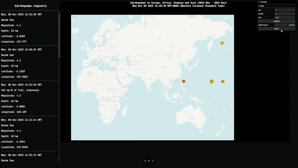

# Mapa de actividad sísmica en Europa, África, Oceania y Asia (2023 Nov - 2024 Nov)

## Descripción general

Este proyecto tiene como objetivo mostrar los terremotos ocurridos en Europa, África, Oceania y Asia en el periodo de un año, desde noviembre de 2023 hasta noviembre de 2024. Para ello, se ha utilizado la API de la [USGS](https://earthquake.usgs.gov/earthquakes/search/) (United States Geological Survey) para obtener los datos de los terremotos ocurridos en este periodo y se han representado en un mapa interactivo.

Los datos obtenidos están entre la región con latitud y longitud [-50.289, 72.541] y [-23.906, 190.195] respectivamente. Se han filtrado los terremotos con magnitud mayor o igual a 2.5.

[Vídeo de presentación](https://alumnosulpgc-my.sharepoint.com/:v:/g/personal/naixin_chen101_alu_ulpgc_es/ESKXqeoyUtpGkS-aWbSjYFQBBL9V8hy2YCL8kXIs_Itj5Q?e=vHLUr5)
